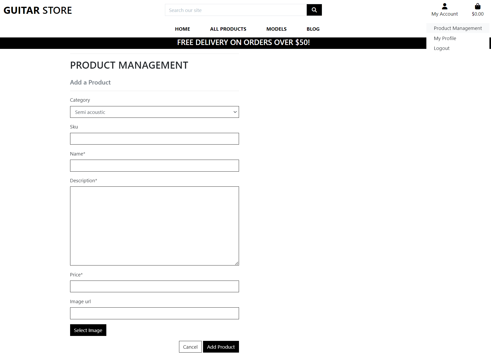

# Guitar Store

Developer: <a href='https://www.linkedin.com/in/omurilolima/' target='_blank'>Murilo Lima</a>

Visit the [live site](https://murilo-guitar-shop-dee69b8139e5.herokuapp.com/)

This is my final project for the Full-Stack Software Development Course at Code Institute / University College Dublin


- [Introdution](#introdution)
    - [Business goals addressed with this site](#business-goals-addressed-with-this-site)
    - [Customer needs](#customer-needs)
- [UX](#ux)
    - [Business Goals](#business-goals-addressed-with-this-site)
    - [Ideal client](#ideal-client)
    - [Strategy](#strategy)
    - [Colour scheme](#colour-scheme)
    - [Typography](#typography)
    - [Images and Post Content](#images-and-post-content)
    - [Wireframes](#wireframes)
- [Agile Development Process](#agile-development-process)
    - [Strategy](#strategy)
    - [GitHub Projects](#github-projects)
    - [GitHub Issues](#github-issues)
    - [MosCow Prioritization](#moscow-prioritization)
- [User Stories](#user-stories)
- [Features](#features)
    - [Existing Features](#existing-features)
    - [Features to Implement in Future](#features-to-implement-in-future)
- [Database Design](#database-design)
- [Ecommerce Business Model](#ecommerce-business-model)
- [Search Engine Optimization (SEO) & Social Media Marketing](#search-engine-optimization-seo--social-media-marketing)
    - [Description and Keywords](#description-and-keywords)
    - [Sitemap](#sitemap)
    - [Robots](#robots)
    - [Social Media Marketing](#social-media-marketing)
    - [Newsletter Marketing](#newsletter-marketing)
- [Testing](#testing)
    - Code Validation
    - Manual testing of user stories
    - Performing tests on various devices
    - Browser compatibility
- [Technologies Used](#technologies-used)
- [Configuration](#configuration)
    - Forking the GitHub Repository
    - PostgreSQL Database
    - Deploy with Heroku
    - Pre Production Deployment
- [Credits](#credits)
    - [Content](#content)
    - [Acknowledgements](#acknowledgements)


## Introdution

The Guitar Store is a comprehensive Django website specialized created for an Irish local store sell guitars online. There, users can search for products, buy them securely using Stripe Payments,  create a profile to leave product reviews, besides to keep an Order History. Also, the site a newsletter sign up and a blog section where users  can find content about Music and Instruments and interact adding a comment or liking a post.

### Business goals addressed with this site
- Build brand awareness;
- Prensent the business value proposition with high-quality content;
- Catch customer's attention and offer a good experience on buying a new guitar.

### Customer needs
- Understand the purpose of the Guitar Store;
- Buy a new guitar.
- Keep Order History.
- Signup to the newsletter for receiving news and 
discount cupoms.
- Interact with content about music and guitar;

### Ideal client
- English speaking;
- Has interest about guitar;
- Want to buy a new instrument.

Back to [top](#table-of-contents)

## UX

Thinking about the design was really simple. The guitars are the beauty. So I kept as simple and clean as possible.

The site flow is pretty basic, but efficient. The users can add items to their shopping bag and see the running total as they browse the site. This is a essential function to easy the buying process.

I've included an footer with a signup form where users can receive exclusive offers and discount codes by subscribing to the newsletter.

### Colour Scheme

I used [coolors.co](https://coolors.co/) to generate my colour palette.


### Typography

I used Google Fonts to select and import the font Poppins, including for main headers and the logo because it is modern but easily readable at the same time. [Lato](https://fonts.google.com/specimen/Lato) was used for all the text.

Example:


### Images and Post Content

All the guitar images on the site were gathered on [Thomann](https://thomann.de/ie/) website.
The blog posts were oginaly published by [Guitar Player](https://www.guitarplayer.com/) magazine.

### Wireframes

I've used [Figma](https://www.figma.com/) to design my site wireframes.

| Page | Wireframe |
| --- | --- |
| Home |  |
| All products |  |
| Product detail |  |

Back to [top](#table-of-contents)

## Agile Development Process

### Strategy

 This project uses Agile Methodology. A planning session generated 34 Tasks through 29 User Stories and 8 Epics, each one with their acceptance criterias. 2 of then was not implemented and they are listed in the "Features to Implement in the Future" session. The development process was based on iterative incremental philosophy, adopting 1 week sprints with the following goals:

- <strong>Week 1</strong>: Basic structure and features running with boilerplate design and content.
- <strong>Week 2</strong>: CRUD functionalities of product section running with boilerplate design and content.
- <strong>Week 3</strong>: CRUD functionalities of blog section + Final version of the design and content + Messages.
- <strong>Week 4</strong>: Testing, final deploy and documentation.

### GitHub Projects

For this project, GitHub Projects was utilized as an Agile tool. While it's not a specialized tool, it can be customized with the appropriate tags and project creation/issue assignments to make it effective. User stories, issues, and milestone tasks were planned using it, then tracked on a weekly basis using the basic Kanban board.

 

### GitHub Issues

GitHub Issues served as an another Agile tool for manage the issues throughout the development process.

 

### MoSCoW Prioritization

For prioritization, I used the MoSCow framework, adding labels to my tasks and user stories within the Github Issues.

- **Must Have**: guaranteed to be delivered (*max 60% of stories*)
- **Should Have**: adds significant value, but not vital (*the rest ~20% of stories*)
- **Could Have**: has small impact if left out (*20% of stories*)
- **Won't Have**: This will not be worked on

## User Stories

In order to enhance the efficiency of this project's development process, I mapped out 34 tasks through 29 user stories to build the website to a good standard. In addition, I splited these user stories into epics in order to take an agile approach towards their development.

View a full list of user stories [here](https://github.com/users/omurilolima/projects/4/views/1?layout=table&visibleFields=%5B%22Title%22%2C%22Status%22%2C%22Labels%22%2C%22Milestone%22%5D).

### EPIC 1: General Site Functionality

- As a first-time visitor, I want to see what the site's purpose is so that I can decide whether or not to continue browsing it. `(MUST HAVE)`
- As a user I want to navigate the website's pages so that I can find the content I'm looking for. `(MUST HAVE)`
- As a site user I want to search for specific products in the website. `(SHOULD HAVE)`
- As a site user I want to contact the site owners so that I can request further information or lodge a complaint. `(WON'T HAVE)`

### EPIC 2: Products

- As a site user I want to see a list of all site products so that I can understand what the store's catalogue is. `(MUST HAVE)`
- As a site user I want to see the product price so that I can make a decision whether or not to purchase. `(MUST HAVE)`
- As a site user I want to view the product details page for more information about a particular product. `(MUST HAVE)`
- As a site user I want to sort products by category so that I can find related products of the same category. `(SHOULD HAVE)`
- As a site user I want to sort products by category so that I can find related products of the same category. `(SHOULD HAVE)`

- As a site user, I want to leave a review of a specific product so that I share my opinion and help other users who want to buy the same product. `(SHOULD HAVE)`

### EPIC 3: Ordering/Cart Management

- As a site user to add products to my shopping cart so that I can proceed to the checkout and purchase them. `(MUST HAVE)`
- As a site user I want to see the subtotal of the items in my basket to know what to expect at the checkout. `(MUST HAVE)`
- As a site user I want to checkout with a card payment so that I can place an order for the items in my shopping cart. `(MUST HAVE)`
- As a site user I want to receive an order confirmation email after I purchase so that I can have a record of what I've purchased in my email inbox. `(SHOULD HAVE)`

### EPIC 4: Site User Accounts

- As a site user, I want to login/logout of the site so that I can be an authenticated/not authenticated user. `(MUST HAVE)`
- As a site user I want to create an account on the site so that I can see a history of my purchases on my account and save my billing and shipping details. `(MUST HAVE)`
- As a registered user I want to edit my account details so that I can keep them up to date. `(SHOULD HAVE)`

### EPIC 5: Blog

- As a Site Admin, I want to create, read, update and delete blog posts so that I can manage my blog content. `(COULD HAVE)`
- As a User, I want to leave a comment to engage with the author and other readers. `(COULD HAVE)`
- As a User, I want to like a blog post. `(COULD HAVE)`

### EPIC 6: Site Admin

- As a site admin I want to add new products from the front end so that I can easily manage the catalogue to the site. `(SHOULD HAVE)`
- As a site admin I want to edit existing products so that I can ensure that all product details are up to date. `(SHOULD HAVE)`
- As a site admin I want to delete products from the site so that I can remove any products that are no longer being on the catalogue. `(SHOULD HAVE)`

### EPIC 7: SEO & Marketing

- As a site admin I want to set appropriate meta tags on the site to enhance the chances of potential customers discovering my store via Google searches. `(MUST HAVE)`
- As a site user I want to sign up for the site's mailing list to receive offers and news. `(SHOULD HAVE)`
- As a site admin I want to send emails to people who signed up to the site's mailing list so that I can send out news and offers to them. `(WON'T HAVE)`
- As a site admin I want to be able to share the business on Facebook so that I can reach and market to a broader audience. `(SHOULD HAVE)`

### EPIC 7: Tests
- Manual testing
- Automatic test: Views
- Automatic test: Forms
- Automatic test: Model

Back to [top](#table-of-contents)

## Features

### Existing Features
| Feature | Description | Image |
| --- | --- | --- |
| Hero image | Presents a big image with a call to action for all products page. |  |
| Footer | Divided in three section, presents a description of the Guitar Store wich could be used to displays the physical address. A newsletter subscrition form and the social links |  |
| Search Bar | To find specific products, users can utilize the search bar in the navigation menu. The search term is compared to product names and descriptions to provide a list of products that match the user's search criteria. | 
| Filter by Price or Category | Through the topbar is possible to display the products ordered by price or category |  |
| All Products | This page displays all the available products |  |
| Product card | With a good image of the product, this card displays the name, category and price for a regular user. For the admin, there are two special links for editing or deleting the product. |  |
| Product | This page displays all the detailed informations about the products, besides the 'Add to Bag' buttom and a Reviews section where any logged user can leave a review. |  |
| Bag pop up | When the user add a product to the bag, this pop-up informs that the product was added with success to the bag, besides a summary of the bag and a yellow message about the free delivery offer |  |
| Shopping Bag Page | This page informs the items in the bag page for the user to double chech before the checkout. |  |
| Checkout Page | This page has the user fill in the delivery details and credit card info. For logged users, the name, email and delivery information can be saved to be pre-fill in the purchase. | 
| Order Confirmation Page | Once the order is done, the user will be directed to a confirmation page that informs them that an email containing the order confirmation has been sent to their provided email address. | 
| Profile page | This page stores the user's default delivery information and the order history. Each order number has a link to its order confirmation page | |
| Profile Page | This page stores the user's default delivery information and the order history. Each order number has a link to its order confirmation page | |
| Error Page | If the user ends up in a broken link or a page the doesn't exist, a error page is displayed informing that the page they are looking for isn't available. |  |
| Add Product | As an admin user, there is the possibility of add a new product to the site from the My Account >>> Product Management dropdown menu in the navbar |  |
| Review Product | As a logged user, you can leave a product review and help other users who are interested in that produc too. |  |
| Blog page | Displays a list of articles about music and products that are sold on the site. |  |
| Blog post | Displays an article and the comment setion. |  |


### Features to Implement in Future

- Contact form: Allows the user to send a message to the Site Admin.
	- As a site user I want to contact the site owners so that I can request further information or lodge a complaint.
- Delete account: Allows the user to delete their account
- Wishlist: Allow the user to add a product to their wishlist so that they can receive news and offers about that product.

Back to [top](#table-of-contents)


## Database Design

Before starting code and create models, I built a Relationship Diagrams (ERD) with [Lucidchard](https://lucid.app/) to better visualize the database architecture.

 

### Models
The following models were created for Guitar Store.

- Category
```python
class Category(models.Model):

    class Meta:
        verbose_name_plural = 'Categories'

    name = models.CharField(max_length=254)
    friendly_name = models.CharField(max_length=254, null=True, blank=True)

    def __str__(self):
        return self.name

    def get_friendly_name(self):
        return self.friendly_name
```

- Product
```python
class Product(models.Model):
    category = models.ForeignKey('Category', null=True, blank=True, on_delete=models.SET_NULL)  # noqa
    sku = models.CharField(max_length=254, null=True, blank=True)
    name = models.CharField(max_length=254)
    description = models.TextField()
    price = models.DecimalField(max_digits=6, decimal_places=2)
    image_url = models.URLField(max_length=1024, null=True, blank=True)
    image = models.ImageField(null=True, blank=True)

    def __str__(self):
        return self.name
```

- Review
```python
class Review(models.Model):
    product = models.ForeignKey(
        Product, on_delete=models.CASCADE, related_name='reviews')
    name = models.CharField(max_length=80)
    email = models.EmailField()
    body = models.TextField()
    created_on = models.DateTimeField(auto_now_add=True)
    approved = models.BooleanField(default=False)

    class Meta:
        ordering = ['created_on']

    def __str__(self):
        return f'Review {self.body} by {self.name}'

```

- Profile
```python
class UserProfile(models.Model):
    """
    A user profile model for maintaining default
    delivery information and order history
    """
    user = models.OneToOneField(User, on_delete=models.CASCADE)
    default_phone_number = models.CharField(
        max_length=20, null=True, blank=True)
    default_street_address1 = models.CharField(
        max_length=80, null=True, blank=True)
    default_street_address2 = models.CharField(
        max_length=80, null=True, blank=True)
    default_town_or_city = models.CharField(
        max_length=40, null=True, blank=True)
    default_county = models.CharField(
        max_length=80, null=True, blank=True)
    default_postcode = models.CharField(
        max_length=20, null=True, blank=True)
    default_country = CountryField(
        blank_label='Country', null=True, blank=True)

    def __str__(self):
        return self.user.username

```

- Order
```python
class Order(models.Model):

    order_number = models.CharField(max_length=32, null=False, editable=False)
    user_profile = models.ForeignKey(UserProfile, on_delete=models.SET_NULL,
                                     null=True, blank=True,
                                     related_name='orders')
    full_name = models.CharField(max_length=50, null=False, blank=False)
    email = models.EmailField(max_length=254, null=False, blank=False)
    phone_number = models.CharField(max_length=20, null=False, blank=False)
    country = CountryField(blank_label='Country *', null=False, blank=False)
    postcode = models.CharField(max_length=20, null=True, blank=True)
    town_or_city = models.CharField(max_length=40, null=False, blank=False)
    street_address1 = models.CharField(max_length=80, null=False, blank=False)
    street_address2 = models.CharField(max_length=80, null=True, blank=True)
    county = models.CharField(max_length=80, null=True, blank=True)
    date = models.DateTimeField(auto_now_add=True)
    delivery_cost = models.DecimalField(
        max_digits=6, decimal_places=2, null=False, default=0)
    order_total = models.DecimalField(
        max_digits=10, decimal_places=2, null=False, default=0)
    grand_total = models.DecimalField(
        max_digits=10, decimal_places=2, null=False, default=0)
    original_bag = models.TextField(
        null=False, blank=False, default='')
    stripe_pid = models.CharField(
        max_length=254, null=False, blank=False, default='')

    def _generate_order_number(self):
        """
        Generate a random, unique order number using UUID
        """
        return uuid.uuid4().hex.upper()

    def update_total(self):
        """
        Update grand total each time a line item is added
        accounting for delivery costs.
        """
        self.order_total = self.lineitems.aggregate(
            Sum('lineitem_total'))['lineitem_total__sum'] or 0
        if self.order_total < settings.FREE_DELIVERY_THRESHOLD:
            self.delivery_cost = self.order_total * settings.STANDARD_DELIVERY_PERCENTAGE / 100  # noqa
        else:
            self.delivery_cost = 0
        self.grand_total = self.order_total + self.delivery_cost
        self.save()

    def save(self, *args, **kwargs):
        """ Override the original save method to set the order number
        if it hasn't been set already
        """
        if not self.order_number:
            self.order_number = self._generate_order_number()
        super().save(*args, **kwargs)

    def __str__(self):
        return self.order_number

```

- Order Line Item
```python
class OrderLineItem(models.Model):

    order = models.ForeignKey(
        Order, null=False, blank=False,
        on_delete=models.CASCADE, related_name='lineitems')
    product = models.ForeignKey(
        Product, null=False, blank=False, on_delete=models.CASCADE)
    quantity = models.IntegerField(null=False, blank=False, default=0)
    lineitem_total = models.DecimalField(
        max_digits=6, decimal_places=2, null=False,
        blank=False, editable=False)

    def save(self, *args, **kwargs):
        """
        Override the original save method to set the lineitem total
        and update the order total.
        """
        self.lineitem_total = self.product.price * self.quantity
        super().save(*args, **kwargs)

    def __str__(self):
        return f'SKU {self.product.sku} on order {self.order.order_number}'
```

- Post
```python
class Post(models.Model):
    title = models.CharField(max_length=200, unique=True)
    slug = models.SlugField(max_length=200, unique=True)
    author = models.ForeignKey(
        User, on_delete=models.CASCADE, related_name='blog_post')
    updated_on = models.DateTimeField(auto_now=True)
    content = models.TextField()
    featured_image = models.ImageField(null=True, blank=True)
    excerpt = models.TextField(blank=True)
    created_on = models.DateTimeField(auto_now_add=True)
    status = models.IntegerField(choices=STATUS, default=0)
    likes = models.ManyToManyField(User, related_name='blog_likes', blank=True)

    class Meta:
        ordering = ['-created_on']

    def __str__(self):
        return self.title

    def number_of_likes(self):
        return self.likes.count()
```

- Comment
```python
class Comment(models.Model):
    post = models.ForeignKey(
        Post, on_delete=models.CASCADE, related_name='comments')
    name = models.CharField(max_length=80)
    email = models.EmailField()
    body = models.TextField()
    created_on = models.DateTimeField(auto_now_add=True)
    approved = models.BooleanField(default=False)

    class Meta:
        ordering = ['created_on']

    def __str__(self):
        return f'Comment {self.body} by {self.name}'
```

Back to [top](#table-of-contents)


## Ecommerce Business Model

The Guitar Store is dedicated to selling products to individual customers through a simple Business to Customer model (B2B). The site is still in its early stages; however, it already offers a newsletter and social media marketing links to promote the business. By leveraging social media platforms like Facebook, we can build a community of users around the site, leading to an increase in visitor numbers and consequently more purchases.

The newsletter is an effective tool for us to communicate regular updates to our users. It is an excellent way to share information about special offers, new product updates, changes in business hours, notifications of events, and more. Our goal is to ensure that our users are always up-to-date and informed.

Back to [top](#table-of-contents)

## Search Engine Optimization (SEO) & Social Media Marketing

### Description and Keywords

The following description and kewwords were used as meta tags for improve the score of the site in search engines:
- Description:
```
<meta name="description" content="Find your new Instrument at Guitar Store, in Dublin, Ireland">
```
- Keywords:
```
<meta name="keywords" 
	content="Guitar, Store, Shop, Instrument, Dublin, Ireland, Les Paul, Strat,
	Telecaster, Semihollow, Fender, Gibson, Epiphone, Ibanez">
```

### Sitemap

I used [XML-Sitemaps](https://www.xml-sitemaps.com) to generate a sitemap.xml file.
This is the file generated using my deployed site URL: [sitemap](https://github.com/omurilolima/guitar-store/blob/cc4c8fff5492ac1db263f1607fe81a0ccb2ebf14/sitemap.xml)

### Robots

The [robots.txt](robots.txt) file is at the root-level of this project.
Inside, I've included the default settings as follows:

```
User-agent: *
Disallow: /profiles/
Disallow: /bag/
Sitemap: https://murilo-guitar-shop-dee69b8139e5.herokuapp.com/sitemap.xml
```

### Social Media Marketing

Building a robust social network with active participation and connecting it to your business website can lead to increased sales.

I've created a Facebook business account wich can be acessed in the [following url](https://www.facebook.com/profile.php?id=100095596562947) by the time when this project was sent to Code Institute's validation, but sometimes Facebook exclude 'fake business pages' like these:


### Newsletter Marketing

In the website footer there is a newsletter sign-up form, to allow users to supply their
email address if they are interested in receiving news and discounts cupoms.


Back to [top](#table-of-contents)

## Testing

### HTML Code Validation

The W3C Markup Validation Service was used to validate the HTML of the website. All Django template tags were manually removed with the HTML code copied and inserted to the base template.
🛑🛑 TO-DO
<details>
<summary><strong>base.html</strong> </summary>


</details>

<details>
<summary> <strong>add-product.html</strong></summary>


</details>

<details>
<summary> <strong>bag.html</strong></summary>


</details>

<details>
<summary> <strong>blog.html</strong></summary>


</details>

<details>
<summary> <strong>checkout_success.html</strong></summary>


</details>

<details>
<summary> <strong>checkout.html</strong></summary>


</details>

<details>
<summary> <strong>edit_product.html</strong></summary>


</details>

<details>
<summary> <strong>post_detail.html</strong></summary>


</details>

<details>
<summary> <strong>products.html</strong></summary>


</details>

<details>
<summary> <strong>product-detail.html</strong></summary>


</details>

<details>
<summary> <strong>profile.html</strong></summary>


</details>


### CSS Code Validation
CSS file validation results generated with W3C Validation Service

<details>
<summary> <strong>base.css</strong></summary>


</details>

<details>
<summary> <strong>checkout.css</strong></summary>


</details>

### Manual testing

| Test Label | Test Action | Expected Outcome | Test Outcome |
| --- | --- | --- | --- |
| Site loading | Navigate to the “Homepage”, “Login”, “Register”, “Add a product”, “Logout” and “All Products”, "Blog", "Blog Post" page. | All the pages and elements are loaded according. | PASS  |
| Add a product in the bag | On the product detail page, click the "Add to bag" button”. | The product is added to the bag and can be found in the bag page. | PASS |
| Read a blog post | On the blog homepage, click on one of the cards presented in the “blog posts” section. | All the elements of post_detail are loaded according. | PASS |
| Leave a comment without logging | On the “post page”, without having logged in, go to the comment section. | A message informing that “To see the comments and leave a comment, please log in or create an account.” must be presented followed by the buttons “login” and “register”. | PASS |
| Leave a comment being logged in. | On the “post page”, having logged in, go to the comment section. Write some text and hit the “submit” button. | A message informing that “Your comment is awaiting approval” must be displayed. | PASS  |
| Like a post | On the “post page”, click on the heart icon. | The counter of likes must increase by 1. | PASS  |
| Add a product | On the navbar, click the “Product Management” option, fill out the form and hit the “Submit” button. | A success message must be displayed and the product must be listed on the “All Products” page. | PASS |
| Edit a product | On the products page, click the “Edit” button, change some info on the form and hit the “Submit” button. | A success message must be displayed and the product info must be updated. | PASS |
| Delete a Product | On the products page, click the “Delete”. | The product must be deleted. | PASS |

### Browser Testing
I have tested this application works on the following installed browsers, using a Dell laptop on Windows OS:

- Microsoft Edge 112.0.1722.68
- Google Chrome Version 112.0.5615.138
- Firefox Browser 112.0.1

I have tested this application works on the following Android devices using Chrome browser 112.0.5615.138:

- Samsung Galaxy S20FE with Android 13.
- Samsung Galaxy S22 with Android 13.

### Responsiveness
I used Chrome developer tool to check the responsiveness on different screen sizes:
- 375px (Mobile)
- 728px (Tablet)
- 1024px (laptop)
- 4k (Monitor resolution)

### Automatic Testing

Django testing tools have been used to perform basic automatic testing on Guitar Store Python code for validating the main logical thing. Tests were run using the local SQLite3 database as opposed to the production PostgreSQL database. Those tests achieve 70% coverage.

Test scripts were written for all models.py, forms.py and views.py of the project apps (bag, blog, checkout, guitar store, home, products and profiles);

models.py
views.py
forms.py

### Automatic test: Forms
| Test Label | Test Action | Expected Outcome | Test Outcome |
| --- | --- | --- | --- |
| ProductForm - Name | Input empty value and click submit | Error message: “This field is required” | PASS |
| ProductForm - Description | Input empty value and click submit | Error message: “This field is required” | PASS |
| ProductForm - Price | Input empty value and click submit | Error message: “This field is required” | PASS |
| ProductForm - Image URL | Input empty value and click submit | Image URL is not required | PASS |
| ProductForm - Fields displayed | Check if all fields are explicit in form_metaclass | All the listed fields in the ProductForm are shown for the user. | PASS |
| CheckoutForm - full_name required | Input empty value and click submit | Error message: “This field is required” | PASS |
| CheckoutForm - email required | Input empty value and click submit | Error message: “This field is required” | PASS |
| CheckoutForm - phone_number required | Input empty value and click submit | Error message: “This field is required” | PASS |
| CheckoutForm - street_address1 required | Input empty value and click submit | Error message: “This field is required” | PASS |
| CheckoutForm - street_address2 not required | Input empty value and click submit | Error message: “This field is required” | PASS |
| CheckoutForm - town_or_city required | Input empty value and click submit | Error message: “This field is required” | PASS |
| CheckoutForm - county required | Input empty value and click submit | Error message: “This field is required” | PASS |
| CommentForm body | Input empty value and click submit | Error message: “This field is required” | PASS |
| CommentForm fields | body field is explicit in form metaclass  | Field displayed | PASS |
| Add comment | Add a comment in a blog post  | Comment added | PASS |
| ReviewForm body | Input empty value and click submit | Error message: “This field is required” | PASS |
| ReviewForm fields | body field is explicit in form metaclass  | Field displayed | PASS |
| Add review | Add a product review  | Review added | PASS |

### Automatic test:  Models
| Test Label | Test Action | Expected Outcome | Test Outcome |
| --- | --- | --- | --- |
| Create Product | Testing create a product | Product created | PASS |
| Comment | Creating a comment | str( ) method called by str() return the default f-string. | PASS |


### Automatic test: Views

| Test Label | Test Action | Expected Outcome | Test Outcome |
| --- | --- | --- | --- |
| home | Testing load homepage | Page loaded with home/index.html template | PASS |
| all_products | Testing load all products | Page loaded with products/products.html template | PASS |
| product_detail | Testing load individual product details | Page loaded with products/product_detail.html template | PASS |
| add_product as non-admin user | Testing add a product to the store with a non-admin user | Receives code 301 and is redirected | PASS |
| edit_product | Testing update product info in the store | Product info is updated  | PASS |
| delete_product | Testing delete a product | Product is deleted | PASS |
| Bag page | Testing load bag page | Page loaded with bag/bag.html template | PASS |
| Add to Bag | Testing add a product in the bag and the bag in the session | Product added to the bag and the session | PASS |

Back to [top](#table-of-contents)

## Deployment

The live deployed application can be found deployed on https://murilo-guitar-shop-dee69b8139e5.herokuapp.com/ 

### ElephantSQL Database

This project uses [ElephantSQL](https://www.elephantsql.com) for the PostgreSQL Database.

To obtain your own Postgres Database, sign-up with your GitHub account, then follow these steps:
- Click **Create New Instance** to start a new database.
- Provide a name (this is commonly the name of the project: 🛑 NAME 🛑).
- Select the **Tiny Turtle (Free)** plan.
- You can leave the **Tags** blank.
- Select the **Region** and **Data Center** closest to you.
- Once created, click on the new database name, where you can view the database URL and Password.

### Amazon AWS

This project uses [AWS](https://aws.amazon.com) to store media and static files online, due to the fact that Heroku doesn't persist this type of data.

Once you've created an AWS account and logged-in, follow these series of steps to get your project connected.
Make sure you're on the **AWS Management Console** page.

#### S3 Bucket

- Search for **S3**.
- Create a new bucket, give it a name (matching your Heroku app name), and choose the region closest to you.
- Uncheck **Block all public access**, and acknowledge that the bucket will be public (required for it to work on Heroku).
- From **Object Ownership**, make sure to have **ACLs enabled**, and **Bucket owner preferred** selected.
- From the **Properties** tab, turn on static website hosting, and type `index.html` and `error.html` in their respective fields, then click **Save**.
- From the **Permissions** tab, paste in the following CORS configuration:

	```shell
	[
		{
			"AllowedHeaders": [
				"Authorization"
			],
			"AllowedMethods": [
				"GET"
			],
			"AllowedOrigins": [
				"*"
			],
			"ExposeHeaders": []
		}
	]
	```

- Copy your **ARN** string.
- From the **Bucket Policy** tab, select the **Policy Generator** link, and use the following steps:
	- Policy Type: **S3 Bucket Policy**
	- Effect: **Allow**
	- Principal: `*`
	- Actions: **GetObject**
	- Amazon Resource Name (ARN): **paste-your-ARN-here**
	- Click **Add Statement**
	- Click **Generate Policy**
	- Copy the entire Policy, and paste it into the **Bucket Policy Editor**

		```shell
		{
			"Id": "Policy1234567890",
			"Version": "2012-10-17",
			"Statement": [
				{
					"Sid": "Stmt1234567890",
					"Action": [
						"s3:GetObject"
					],
					"Effect": "Allow",
					"Resource": "arn:aws:s3:::your-bucket-name/*"
					"Principal": "*",
				}
			]
		}
		```

	- Before you click "Save", add `/*` to the end of the Resource key in the Bucket Policy Editor (like above).
	- Click **Save**.
- From the **Access Control List (ACL)** section, click "Edit" and enable **List** for **Everyone (public access)**, and accept the warning box.
	- If the edit button is disabled, you need to change the **Object Ownership** section above to **ACLs enabled** (mentioned above).

#### IAM

Back on the AWS Services Menu, search for and open **IAM** (Identity and Access Management).
Once on the IAM page, follow these steps:

- From **User Groups**, click **Create New Group**.
	- Suggested Name: `group-guitar-store` (group + the project name)
- Tags are optional, but you must click it to get to the **review policy** page.
- From **User Groups**, select your newly created group, and go to the **Permissions** tab.
- Open the **Add Permissions** dropdown, and click **Attach Policies**.
- Select the policy, then click **Add Permissions** at the bottom when finished.
- From the **JSON** tab, select the **Import Managed Policy** link.
	- Search for **S3**, select the `AmazonS3FullAccess` policy, and then **Import**.
	- You'll need your ARN from the S3 Bucket copied again, which is pasted into "Resources" key on the Policy.

		```shell
		{
			"Version": "2012-10-17",
			"Statement": [
				{
					"Effect": "Allow",
					"Action": "s3:*",
					"Resource": [
						"arn:aws:s3:::your-bucket-name",
						"arn:aws:s3:::your-bucket-name/*"
					]
				}
			]
		}
		```
	
	- Click **Review Policy**.
	- Suggested Name: `policy-guitar-store` (policy + the project name)
	- Provide a description:
		- "Access to S3 Bucket for guitar-store static files."
	- Click **Create Policy**.
- From **User Groups**, click your "group-guitar-store".
- Click **Attach Policy**.
- Search for the policy you've just created ("policy-guitar-store") and select it, then **Attach Policy**.
- From **User Groups**, click **Add User**.
	- Suggested Name: `user-guitar-store` (user + the project name)
- For "Select AWS Access Type", select **Programmatic Access**.
- Select the group to add your new user to: `group-guitar-store`
- Tags are optional, but you must click it to get to the **review user** page.
- Click **Create User** once done.
- You should see a button to **Download .csv**, so click it to save a copy on your system.
	- **IMPORTANT**: once you pass this page, you cannot come back to download it again, so do it immediately!
	- This contains the user's **Access key ID** and **Secret access key**.
	- `AWS_ACCESS_KEY_ID` = **Access key ID**
	- `AWS_SECRET_ACCESS_KEY` = **Secret access key**

#### Final AWS Setup

- If Heroku Config Vars has `DISABLE_COLLECTSTATIC` still, this can be removed now, so that AWS will handle the static files.
- Back within **S3**, create a new folder called: `media`.
- Select any existing media images for your project to prepare them for being uploaded into the new folder.
- Under **Manage Public Permissions**, select **Grant public read access to this object(s)**.
- No further settings are required, so click **Upload**.

### Stripe API

This project uses [Stripe](https://stripe.com) to handle the ecommerce payments.

Once you've created a Stripe account and logged-in, follow these series of steps to get your project connected.

- From your Stripe dashboard, click to expand the "Get your test API keys".
- You'll have two keys here:
	- `STRIPE_PUBLIC_KEY` = Publishable Key (starts with **pk**)
	- `STRIPE_SECRET_KEY` = Secret Key (starts with **sk**)

As a backup, in case users prematurely close the purchase-order page during payment, we can include Stripe Webhooks.

- From your Stripe dashboard, click **Developers**, and select **Webhooks**.
- From there, click **Add Endpoint**.
	- Add your deployed site link.
- Click **receive all events**.
- Click **Add Endpoint** to complete the process.
- You'll have a new key here:
	- `STRIPE_WH_SECRET` = Signing Secret (Wehbook) Key (starts with **wh**)

### Gmail API

This project uses [Gmail](https://mail.google.com) to handle sending emails to users for account verification and purchase order confirmations.

Once you've created a Gmail (Google) account and logged-in, follow these series of steps to get your project connected.

- Click on the **Account Settings** (cog icon) in the top-right corner of Gmail.
- Click on the **Accounts and Import** tab.
- Within the section called "Change account settings", click on the link for **Other Google Account settings**.
- From this new page, select **Security** on the left.
- Select **2-Step Verification** to turn it on. (verify your password and account)
- Once verified, select **Turn On** for 2FA.
- Navigate back to the **Security** page, and you'll see a new option called **App passwords**.
- This might prompt you once again to confirm your password and account.
- Select **Mail** for the app type.
- Select **Other (Custom name)** for the device type.
	- Any custom name, such as "Django" or guitar-store
- You'll be provided with a 16-character password (API key).
	- Save this somewhere locally, as you cannot access this key again later!
	- `EMAIL_HOST_PASS` = user's 16-character API key
	- `EMAIL_HOST_USER` = user's own personal Gmail email address

### Heroku Deployment

This project uses [Heroku](https://www.heroku.com), a platform as a service (PaaS) that enables developers to build, run, and operate applications entirely in the cloud.

Deployment steps are as follows, after account setup:

- Select **New** in the top-right corner of your Heroku Dashboard, and select **Create new app** from the dropdown menu.
- Your app name must be unique, and then choose a region closest to you (EU or USA), and finally, select **Create App**.
- From the new app **Settings**, click **Reveal Config Vars**, and set your environment variables.

| Key | Value |
| --- | --- |
| `AWS_ACCESS_KEY_ID` | user's own value |
| `AWS_SECRET_ACCESS_KEY` | user's own value |
| `DATABASE_URL` | user's own value |
| `DISABLE_COLLECTSTATIC` | 1 (*this is temporary, and can be removed for the final deployment*) |
| `EMAIL_HOST_PASS` | user's own value |
| `EMAIL_HOST_USER` | user's own value |
| `SECRET_KEY` | user's own value |
| `STRIPE_PUBLIC_KEY` | user's own value |
| `STRIPE_SECRET_KEY` | user's own value |
| `STRIPE_WH_SECRET` | user's own value |
| `USE_AWS` | True |

Heroku needs two additional files in order to deploy properly.
- requirements.txt
- Procfile

You can install this project's **requirements** (where applicable) using:
- `pip3 install -r requirements.txt`

If you have your own packages that have been installed, then the requirements file needs updated using:
- `pip3 freeze --local > requirements.txt`

The **Procfile** can be created with the following command:
- `echo web: gunicorn app_name.wsgi > Procfile`
- *replace **app_name** with the name of your primary Django app name; the folder where settings.py is located*

For Heroku deployment, follow these steps to connect your own GitHub repository to the newly created app:

Either:
- Select **Automatic Deployment** from the Heroku app.

Or:
- In the Terminal/CLI, connect to Heroku using this command: `heroku login -i`
- Set the remote for Heroku: `heroku git:remote -a app_name` (replace *app_name* with your app name)
- After performing the standard Git `add`, `commit`, and `push` to GitHub, you can now type:
	- `git push heroku main`

The project should now be connected and deployed to Heroku!

### Local Deployment

This project can be cloned or forked in order to make a local copy on your own system.

For either method, you will need to install any applicable packages found within the *requirements.txt* file.
- `pip3 install -r requirements.txt`.

You will need to create a new file called `env.py` at the root-level,
and include the same environment variables listed above from the Heroku deployment steps.

Sample `env.py` file:

```python
import os

os.environ.setdefault("AWS_ACCESS_KEY_ID", "user's own value")
os.environ.setdefault("AWS_SECRET_ACCESS_KEY", "user's own value")
os.environ.setdefault("DATABASE_URL", "user's own value")
os.environ.setdefault("EMAIL_HOST_PASS", "user's own value")
os.environ.setdefault("EMAIL_HOST_USER", "user's own value")
os.environ.setdefault("SECRET_KEY", "user's own value")
os.environ.setdefault("STRIPE_PUBLIC_KEY", "user's own value")
os.environ.setdefault("STRIPE_SECRET_KEY", "user's own value")
os.environ.setdefault("STRIPE_WH_SECRET", "user's own value")

# local environment only (do not include these in production/deployment!)
os.environ.setdefault("DEBUG", "True")
```

Once the project is cloned or forked, in order to run it locally, you'll need to follow these steps:
- Start the Django app: `python3 manage.py runserver`
- Stop the app once it's loaded: `CTRL+C` or `⌘+C` (Mac)
- Make any necessary migrations: `python3 manage.py makemigrations`
- Migrate the data to the database: `python3 manage.py migrate`
- Create a superuser: `python3 manage.py createsuperuser`
- Load fixtures (if applicable): `python3 manage.py loaddata file-name.json` (repeat for each file)
- Everything should be ready now, so run the Django app again: `python3 manage.py runserver`

If you'd like to backup your database models, use the following command for each model you'd like to create a fixture for:
- `python3 manage.py dumpdata your-model > your-model.json`
- *repeat this action for each model you wish to backup*

#### Cloning

You can clone the repository by following these steps:

1. Go to the [GitHub repository](https://github.com/omurilolima/guitar-store) 
2. Locate the Code button above the list of files and click it 
3. Select if you prefer to clone using HTTPS, SSH, or GitHub CLI and click the copy button to copy the URL to your clipboard
4. Open Git Bash or Terminal
5. Change the current working directory to the one where you want the cloned directory
6. In your IDE Terminal, type the following command to clone my repository:
	- `git clone https://github.com/omurilolima/guitar-store.git`
7. Press Enter to create your local clone.

Alternatively, if using Gitpod, you can click below to create your own workspace using this repository.

[](https://gitpod.io/#https://github.com/omurilolima/guitar-store)

Please note that in order to directly open the project in Gitpod, you need to have the browser extension installed.
A tutorial on how to do that can be found [here](https://www.gitpod.io/docs/configure/user-settings/browser-extension).

#### Forking

By forking the GitHub Repository, we make a copy of the original repository on our GitHub account to view and/or make changes without affecting the original owner's repository.
You can fork this repository by using the following steps:

1. Log in to GitHub and locate the [GitHub Repository](https://github.com/omurilolima/guitar-store)
2. At the top of the Repository (not top of page) just above the "Settings" Button on the menu, locate the "Fork" Button.
3. Once clicked, you should now have a copy of the original repository in your own GitHub account!

Back to [top](#table-of-contents)

## Tools & Technologies Used
### Programming Languages

- [Python](https://www.python.org) used as the back-end programming language.
- [JavaScript](https://www.javascript.com) used for user interaction on the site.
- [CSS](https://en.wikipedia.org/wiki/CSS) used for the main site design and layout.
- [HTML](https://en.wikipedia.org/wiki/HTML) used for the main site content.

### Hosting and Database
- [AWS S3](https://aws.amazon.com/s3) used for online static file storage.- 
- [GitHub](https://github.com) used for secure online code storage.

### Frameworks and Libraries
- [Django](https://www.djangoproject.com) used as the Python framework for the site.
- [Bootstrap 4](https://getbootstrap.com) used as the front-end CSS framework for modern responsiveness and pre-built components.
- [PostgreSQL](https://www.postgresql.org) used as the relational database management.
- [ElephantSQL](https://www.elephantsql.com) used as the Postgres database.
- [Heroku](https://www.heroku.com) used for hosting the deployed back-end site.

### Tools and Web Applications
- [Stripe](https://stripe.com) used for online secure payments of ecommerce products/services.
- [Git](https://git-scm.com) used for version control. (`git add`, `git commit`, `git push`)
- [Figma](https://figma.com): used for creating wireframes.
- [Gitpod](https://gitpod.io) used as a cloud-based IDE for development.
- [Lucidchart](https://www.lucidchart.com/) used to design the database diagram.

### Code Validation
- [JSHint](https://jshint.com/): used for Javascript code validation.
- [PEP8](https://peps.python.org/pep-0008/): used for Python code validation.
- [Lighthouse](https://developer.chrome.com/docs/devtools/) Testing site performance on desktop and mobile devices.
- [W3C HTML](https://validator.w3.org/): used for HTML code validation.
- [W3C CSS](https://jigsaw.w3.org/css-validator/): used for CSS code validation.

Back to [top](#table-of-contents)

## Credits

### Content

- All the guitar images were taken from [Thomann](https://www.thomann.de/ie/index.html).
- All the blog content was taken from the [Guitar Player](https://www.guitarplayer.com/)
- README Documenting was inspired by [Retro Reboot](https://github.com/adamgilroy22/retro-reboot/) and [FreshCats](https://github.com/RickofManc/fresh-casts)

### Acknowledgements

- I would like to thank my wife (Larissa Paz), for believing in me, and allowing me to make this transition into software development.
- I would like to thank my Code Institute's menthor, Brian Macharia, and the tutor team for their assistance with troubleshooting and debugging some project issues.
- I would like to thank the Code Institute Slack community for the moral support; it kept me going during periods of self doubt and imposter syndrome.

Back to [top](#table-of-contents)